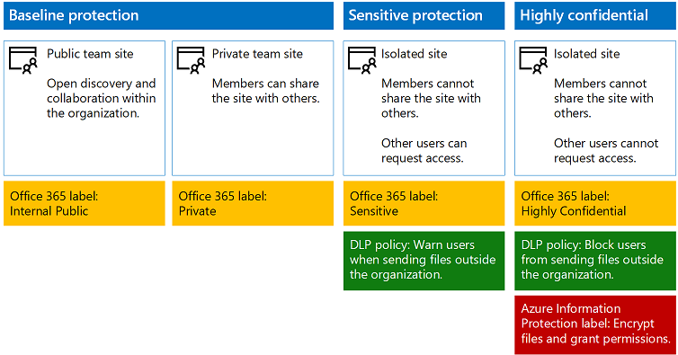

# Proteggere siti e file di SharePoint Online

Questo articolo illustra come configurare la protezione di siti e file del team di SharePoint Online in modo da bilanciare la sicurezza con la facilità di collaborazione. L'articolo definisce quattro diverse configurazioni, a partire da un sito pubblico interno all'organizzazione con i criteri di condivisione più aperti. Ogni configurazione aggiuntiva rappresenta un miglioramento significativo in termini di protezione, ma la possibilità di accedere e collaborare sulle risorse si riduce al gruppo di utenti interessati. 

Usare questi suggerimenti come punto di partenza e modificare le configurazioni per soddisfare le esigenze della propria organizzazione. 

Le configurazioni descritte in questo articolo sono allineate alle raccomandazioni di Microsoft per i tre livelli di protezione per dati, identità e dispositivi:

* Protezione di base
* Protezione dati sensibili
* Protezione dati altamente riservati

Per altre informazioni su questi livelli e sulle funzionalità consigliate per ogni livello, vedere le risorse seguenti. 

* [Identità e sicurezza dei dispositivi per Office 365](https://technet.microsoft.com/library/28986107-e2fb-4116-bfdd-f66d751a7c16#BKMK_O365IDP)
* [Soluzioni per la protezione dei file in Office 365](https://technet.microsoft.com/library/28986107-e2fb-4116-bfdd-f66d751a7c16#BKMK_O365fileprotect)

## Panoramica delle funzionalità
I consigli per i siti del team di SharePoint Online si basano su una vasta gamma di funzionalità di Office 365. Per i siti strettamente riservati, è consigliabile usare Azure Information Protection, incluso in Enterprise Mobility + Security (EMS). 

Il diagramma seguente illustra le configurazioni consigliate per quattro siti del team di SharePoint Online.

 

Come illustrato nell'esempio:

* La protezione di base include due opzioni per i siti del team di SharePoint Online, un sito pubblico e un sito privato. I siti pubblici possono essere individuati e usati da qualsiasi persona dell'organizzazione. I siti privati possono essere individuati e usati solo dai membri del sito. Queste configurazioni del sito consentono entrambe la condivisione all'esterno del gruppo. 
* I siti per la protezione dei dati sensibili ed estremamente riservati sono siti privati con accesso limitato solo ai membri di gruppi specifici.
* Le etichette di Office 365 consentono di classificare i dati con un livello di protezione necessario. Ogni sito del team di SharePoint Online è configurato in modo da etichettare automaticamente i file delle raccolte di documenti con un'etichetta predefinita per il sito. In questo esempio le etichette, che corrispondono alle quattro configurazioni dei siti, sono Internal Public (Pubblico interno), Private (Privato), Sensitive (Dati sensibili) e Highly Confidential (Riservatezza elevata). Gli utenti possono modificare le etichette, ma questa configurazione garantisce che tutti i file ricevano un'etichetta predefinita.
* Vengono configurati criteri di prevenzione della perdita di dati per le etichette Sensitive e Highly Confidential di Office 365 per avvisare o bloccare gli utenti quando tentano di inviare questi tipi di file all'esterno dell'organizzazione.
* Per i siti configurati con la protezione dei dati altamente riservati, Azure Information Protection crittografa e concede le autorizzazioni per i file.

## Impostazioni a livello di tenant per SharePoint Online e OneDrive for Business
SharePoint Online e OneDrive for Business includono impostazioni a livello di tenant che influiscono su tutti i siti e tutti gli utenti. Alcune di queste impostazioni si possono modificare anche a livello di sito in modo che siano più restrittive (ma non meno). In questa sezione vengono illustrate le impostazioni a livello di tenant che influiscono sulla sicurezza e sulla collaborazione. 

### Condivisione
Per questa soluzione, è consigliabile usare le seguenti impostazioni a livello di tenant:

* Mantenere il criterio di condivisione predefinito che consente la condivisione completa, inclusa quella anonima, con tutti i tipi di account.
* Se necessario, impostare i collegamenti anonimi in modo che scadano.
* Modificare il tipo di collegamento predefinito per la condivisione impostandolo su Interno. In questo modo si impedisce la fuga accidentale di dati all'esterno dell'organizzazione.

Anche se può sembrare illogico consentire la condivisione esterna, questo approccio offre un maggiore controllo sulla condivisione dei file rispetto all'invio dei file con i messaggi di posta elettronica. SharePoint Online e Outlook interagiscono in modo da garantire la sicurezza della collaborazione sui file. 

* Per impostazione predefinita, Outlook condivide un collegamento a un file anziché inviare il file in un messaggio di posta elettronica. 
* SharePoint Online e OneDrive for Business semplificano la condivisione dei collegamenti ai file con i collaboratori sia all'interno che all'esterno dell'organizzazione.

Sono anche disponibili controlli che consentono di gestire la condivisione esterna. Ad esempio, è possibile:

* Disabilitare un collegamento guest anonimo.
* Revocare l'accesso utente a un sito.
* Vedere chi ha accesso a un documento o un sito specifico.
* Impostare i collegamenti di condivisione anonimi in modo che abbiano una scadenza (impostazione del tenant).
* Limitare gli utenti che possono condividere all'esterno dell'organizzazione (impostazione del tenant).

### Usare la condivisione esterna con la prevenzione della perdita di dati
Se non si consente la condivisione esterna, gli utenti con esigenze aziendali troveranno strumenti e metodi alternativi. Microsoft consiglia di combinare la condivisione esterna con i criteri di prevenzione della perdita di dati per proteggere i file sensibili e altamente riservati.

### Impostazioni di accesso dispositivo
Le impostazioni di accesso dispositivo per SharePoint Online e OneDrive for Business consentono di determinare se l'accesso è limitato solo al browser (non è possibile scaricare i file) o se l'accesso è bloccato. Queste impostazioni sono attualmente nella prima versione e si applicano a livello di tenant. Sarà presto disponibile la possibilità di configurare i criteri di accesso dispositivo a livello di sito. Per questa soluzione, è consigliabile non usare impostazioni di accesso dispositivo valide a livello di tenant.

Per usare le impostazioni di accesso dispositivo mentre sono nella prima versione: [Impostare le opzioni Standard o First Release in Office 365](https://support.office.com/article/Set-up-the-Standard-or-First-Release-options-in-Office-365-3B3ADFA4-1777-4FF0-B606-FB8732101F47).

### OneDrive for Business
Esaminare queste impostazioni per decidere se si vuole modificare le impostazioni predefinite per i siti di OneDrive for Business. Attualmente, le impostazioni di accesso dispositivo e condivisione vengono duplicate dall'interfaccia di amministrazione di SharePoint Online e applicate a entrambi gli ambienti.

## Configurazione del sito del team di SharePoint
Nella tabella seguente viene riepilogata la configurazione per ciascuno dei siti del team descritti in precedenza in questo articolo. Usare queste configurazioni come punto di partenza e modificare i tipi di sito e le relative configurazioni per soddisfare le esigenze della propria organizzazione. Non tutte le organizzazioni necessitano ogni tipo di sito. Solo un numero ridotto di organizzazioni richiede la protezione dei dati con riservatezza elevata.

| |**Protezione di base 1**|**Protezione di base 2**|**Protezione dati sensibili**|**Riservatezza elevata**|
|:-----|:-----|:-----|:-----|:-----|
|Descrizione|Individuazione e collaborazione aperte all'interno dell'organizzazione.|Sito privato e gruppo con condivisione consentita all'esterno del gruppo.|Sito isolato, in cui i livelli di accesso sono definiti dall'appartenenza a gruppi specifici. La condivisione è consentita solo ai membri del sito. La prevenzione della perdita di dati avvisa gli utenti quando tentano di inviare file all'esterno dell'organizzazione.|Sito isolato + crittografia dei file e autorizzazioni con Azure Information Protection. La prevenzione della perdita dei dati impedisce agli utenti di inviare file all'esterno dell'organizzazione.|
|Sito del team privato o pubblico|Pubblico|Private|Private|Private|
|Chi può accedere?|Tutti gli utenti dell'organizzazione, inclusi gli utenti B2B e gli utenti guest.|Solo i membri del sito. Altri utenti possono richiedere l'accesso.|Solo i membri del sito. Altri utenti possono richiedere l'accesso.|Solo i membri. Altri utenti non possono richiedere l'accesso.|
|Controlli della condivisione a livello di sito|Condivisione consentita con chiunque. Impostazioni predefinite.    |Condivisione consentita con chiunque. Impostazioni predefinite.|I membri non possono condividere l'accesso al sito.  I non membri possono richiedere l'accesso al sito, ma tali richieste devono essere gestite da un amministratore del sito.|I membri non possono condividere l'accesso al sito.  I non membri non possono richiedere l'accesso al sito o ai contenuti.|
|Controlli di accesso dispositivo a livello di sito|Nessun controllo aggiuntivo.|Nessun controllo aggiuntivo.|Saranno presto disponibili controlli a livello di sito che impediscono agli utenti di scaricare i file su dispositivi non conformi o non aggiunti al dominio. Ciò consente l'accesso solo dal browser da tutti gli altri dispositivi.|Saranno presto disponibili controlli a livello di sito che bloccano il download dei file su dispositivi non conformi o non aggiunti al dominio.|
|Etichette di Office 365|Internal Public|Private|Sensitive|Highly Confidential (Riservatezza elevata)|
|Criteri di prevenzione della perdita di dati (DLP)|||Gli utenti vengono avvisati se inviano file con etichetta Sensitive (Dati sensibili) all'esterno dell'organizzazione.  Per bloccare la condivisione esterna di tipi di dati sensibili, ad esempio numeri di carta di credito o altri dati personali, è possibile configurare criteri DLP aggiuntivi per questi tipi di dati, inclusi i tipi di dati personalizzati configurati dall'utente.|Agli utenti viene impedito di inviare file con etichetta Highly Confidential (Riservatezza elevata) all'esterno dell'organizzazione. Gli utenti possono ignorare questa limitazione giustificando l'invio, indicando ad esempio con chi condividono il file.|
|Azure Information Protection||||Usare Azure Information Protection per crittografare e concedere automaticamente le autorizzazioni per i file. Questa protezione viene trasferita con i file in caso di fuga. Office 365 non è in grado di leggere i file crittografati con Azure Information Protection. Inoltre, i criteri DLP funzionano solo con i metadati, incluse le etichette, ma non con il contenuto dei file, ad esempio i numeri di carta di credito all'interno dei file.|

Per informazioni sulla distribuzione dei quattro tipi diversi di siti del team di SharePoint Online in questa soluzione, vedere [Distribuire siti per tre livelli di protezione](deploy-sites-for-three-tiers-of-protection.md).

## Classificazione ed etichette di Office 365
L'uso delle etichette di Office 365 è consigliato per gli ambienti con dati sensibili. Dopo aver configurato e pubblicato le etichette di Office 365, è possibile:

* Applicare un'etichetta predefinita a una raccolta di documenti in un sito del team di SharePoint Online, in modo che tutti i documenti inclusi nella raccolta abbiano l'etichetta predefinita. 
* Applicare automaticamente le etichette al contenuto se sono soddisfatte condizioni specifiche.
* Creare criteri DLP basati sulle etichette di Office 365.
* Consentire agli utenti dell'organizzazione di applicare manualmente un'etichetta al contenuto in Outlook sul Web, Outlook 2010 e versioni successive, OneDrive for Business, SharePoint Online e gruppi di Office 365. Gli utenti spesso conoscono meglio il tipo di contenuto su cui stanno lavorando, quindi possono classificarlo e applicare i criteri DLP appropriati.

 
 
Come indica l'illustrazione, questa soluzione include la creazione delle etichette seguenti:

* Highly Confidential (Riservatezza elevata)
* Sensitive
* Private
* Internal Public

Le etichette vengono mappate ai siti consigliati nelle illustrazioni e nei grafici presentati in precedenza in questo articolo. Questa soluzione consiglia di configurare criteri DLP per impedire la fuga di file etichettati come sensibili ed estremamente riservati.

Per informazioni sulla configurazione delle etichette di Office 365 e dei criteri di prevenzione della perdita di dati in questa soluzione, vedere [Proteggere file con le etichette di Office 365 e DLP](protect-files-with-o365-labels-dlp.md).

## Azure Information Protection
Usare Azure Information Protection per applicare le etichette e le protezioni che seguono i file ovunque vanno. Per questa soluzione, si consiglia di usare l'etichetta Highly Confidential (Riservatezza elevata) per crittografare e concedere le autorizzazioni per i file che devono essere protetti con il massimo livello di sicurezza. 

Tenere presente che quando si applica la crittografia di Azure Rights Management ai file archiviati in Office 365, il servizio non è in grado di elaborare il contenuto di questi file. La creazione condivisa, eDiscovery, la ricerca, Delve e altre funzionalità di collaborazione non funzionano. I criteri DLP possono eseguire azioni in base alle etichette di Office 365, ma non sul contenuto dei file.

 

Come illustrato nell'esempio:

* Azure Information Protection viene configurato nel portale di Microsoft Azure. È consigliabile configurare l'etichetta Highly Confidential nel criterio Azure Information Protection globale.
* Le etichette di Azure Information Protection sono visualizzate come barra degli strumenti **Riservatezza** nelle applicazioni di Office. 

### Aggiunta delle autorizzazioni per gli utenti esterni
Esistono due modi per concedere agli utenti esterni l'accesso ai file protetti con Azure Information Protection. In entrambi i casi gli utenti esterni devono avere un account Azure AD. Se gli utenti esterni non sono membri di un'organizzazione che usa Azure AD, possono ottenere un account Azure AD come utente singolo da questa pagina di iscrizione: [https://aka.ms/aip-signup](https://aka.ms/aip-signup).

* **Aggiungere gli utenti esterni a un gruppo di Azure AD usato per configurare la protezione per un'etichetta**.
 È necessario per prima cosa aggiungere l'account come utente B2B nella propria directory. Il [caching dell'appartenenza a gruppi da parte di Azure Rights Management](https://docs.microsoft.com/information-protection/plan-design/prepare#group-membership-caching-by-azure-rights-management) può richiedere un paio d'ore. Con questo metodo, le autorizzazioni vengono concesse per tutti i file esistenti protetti con l'etichetta, inclusi i file protetti prima dell'aggiunta di un utente al gruppo di Azure AD.

* **Aggiungere gli utenti esterni direttamente alla protezione dell'etichetta**.
 È possibile aggiungere tutti gli utenti di un'organizzazione (ad esempio, Fabrikam.com), un gruppo di Azure AD (ad esempio, un gruppo di contabilità all'interno di un'organizzazione) o un singolo utente. Ad esempio, è possibile aggiungere un team esterno di regolatori alla protezione per un'etichetta. Con questo metodo, le autorizzazioni vengono concesse solo per i file protetti con l'etichetta dopo l'aggiunta dell'entità esterna alla protezione.

### Distribuzione e uso di Azure Information Protection
Per informazioni sulla configurazione di Azure Information Protection in questa soluzione, vedere l'articolo relativo alla [protezione dei file con Azure Information Protection](protect-files-with-aip.md).

## Passaggi successivi 

[Guida alla sicurezza Microsoft per campagne politiche, organizzazioni no profit e altre organizzazioni Agile](https://technet.microsoft.com/library/mt493213.aspx)

[Soluzioni di sicurezza](https://technet.microsoft.com/library/mt784690.aspx)

[Adozione del cloud e soluzioni ibride](https://technet.microsoft.com/library/dn262744.aspx)

[Proteggere i siti di SharePoint Online in un ambiente di sviluppo/test](secure-sharepoint-online-sites-dev-test.md)
 